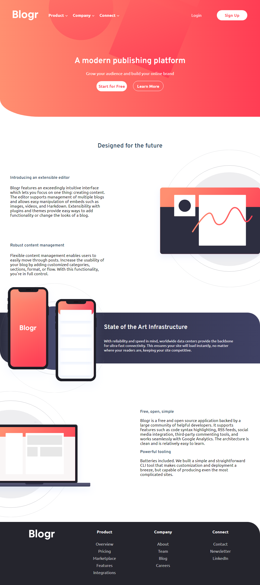

# Frontend Mentor - Blogr landing page solution

This is a solution to the [Blogr landing page challenge on Frontend Mentor](https://www.frontendmentor.io/challenges/blogr-landing-page-EX2RLAApP). Frontend Mentor challenges help you improve your coding skills by building realistic projects. 

## Table of contents

- [Overview](#overview)
  - [The challenge](#the-challenge)
  - [Screenshot](#screenshot)
  - [Links](#links)
- [Author](#author)
- [Acknowledgments](#acknowledgments)

## Overview

### The challenge

Users should be able to:

- View the optimal layout for the site depending on their device's screen size
- See hover states for all interactive elements on the page

### Screenshot

### Links

- Solution URL: [https://github.com/anasmus/blogr-page](https://github.com/anasmus/blogr-page)
- Live Site URL: [https://blogr-anas.netlify.app/](https://blogr-anas.netlify.app/)

### Continued development

Page does not look the same in Firefox and still needs to be fixed. CSS needs refactoring and I want to focus on organizing it better.

## Author

- Github - [Anas Mustafa](https://github.com/anasmus)
- Frontend Mentor - [@anasmus](https://www.frontendmentor.io/profile/anasmus)

